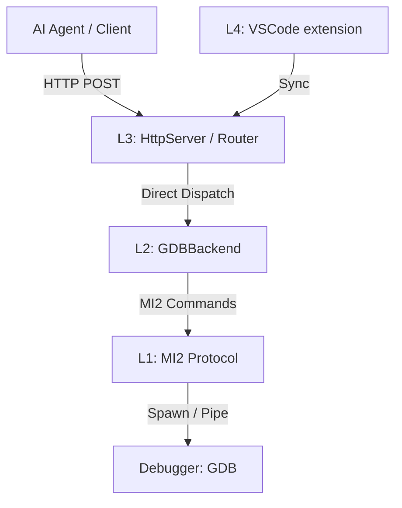

# AI Debug Proxy v3.0 Alpha

**High-Performance REST Interface for GDB — Architected for AI Agents**

[](docs/qa/qa-checklist.md)
[](docs/testing/index.html)
[](LICENSE)

AI Debug Proxy is a low-latency gateway that transforms the complex GDB/MI internal protocol into a developer-friendly RESTful API. Designed specifically for LLM-based autonomous coding agents, it provides the deterministic control and deep visibility required for automated debugging.

---

## 🚀 Why AI Debug Proxy?

*   **AI-Native API**: Single-endpoint operation dispatch optimized for token efficiency.
*   **Layered Architecture**: Robust separation between protocol parsing, debugger backends, and server logic.
*   **Safe Execution**: Built-in argument validation and security fuzzing for untrusted inputs.
*   **VS Code Integrated**: Works as a standard VS Code extension while providing headless automation.
*   **Protocol Neutral**: Unified `IDebugBackend` interface supporting GDB/MI (standard) with planned LLDB and custom probe support.

---

## 🏗 System Architecture

The v3.0 core is built on a 6-layer decoupled architecture to ensure maintenance stability and high testability.



Detailed diagrams available in [docs/arch/](docs/arch/):
- [System Context](docs/arch/01-system-context.puml)
- [Component Overview](docs/arch/02-component-diagram.puml)
- [Sequence: Launch Flow](docs/arch/04-sequence-launch.puml)

---

## 🛠 Getting Started

### Prerequisites

*   **Node.js** v18 or later
*   **GDB** (GNU Debugger) in your system PATH
*   **VS Code** (Optional, for extension-host features)

### Installation

1.  Clone the repository and install dependencies:
    ```bash
    git clone https://github.com/datdang-dev/ai-vscode-debug-proxy.git
    cd ai-vscode-debug-proxy
    npm install
    ```
2.  Compile the project:
    ```bash
    npm run compile
    ```
3.  Load the extension in VS Code via **Extension Development Host** (`F5`).

---

## 📖 Usage Example

Start a debugging session with a single curl command:

```bash
# Launch a debug target
curl -X POST http://localhost:9999/api/debug/execute_operation \
  -H "Content-Type: application/json" \
  -d '{
    "operation": "launch",
    "params": {
      "program": "./build/app.out",
      "args": ["--verbose"],
      "stopOnEntry": true
    }
  }'
```

Refer to the [API Reference](docs/api-reference.md) for the full list of supported operations.

---

## 🧪 Quality & Verification

We maintain a strict quality gate for the Alpha release:

*   **Unit Tests**: 150+ tests covering all core components via Vitest.
*   **E2E Suite**: Full integration tests using real GDB instances.
*   **Test Matrix**: [Interactive Test Catalog](docs/testing/index.html)
*   **Security Suite**: Fuzz testing and path traversal protection verified.

---

## 📚 Documentation

- [User Guide](docs/user-guide.md) — Setup, configuration, and best practices.
- [API Reference](docs/api-reference.md) — Detailed operation schema and examples.
- [Architecture Analysis](docs/arch/README.md) — Technical deep dive.
- [QA Checklist](docs/qa/qa-checklist.md) — Release readiness status.

---

## 📄 License

MIT &copy; 2026 AI Debug Proxy Team. Built with 💖 for the AI developer community.
